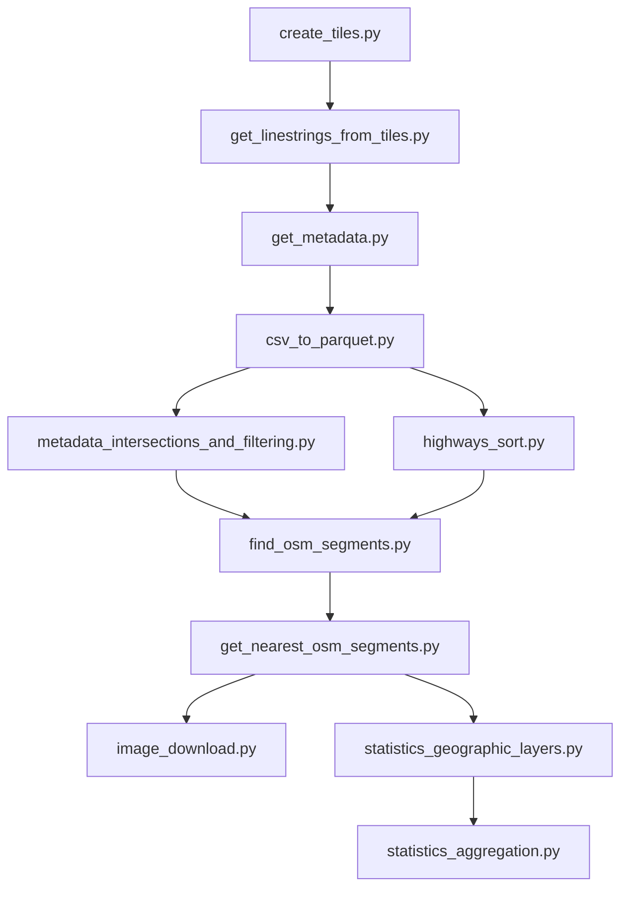

# Mapillary Road Surface Pipeline

## 1) Project Overview

This repository implements a tile-based processing pipeline that combines Mapillary street-level metadata and OpenStreetMap (OSM) road data to compute road-surface statistics (for example paved vs. unpaved) across multiple spatial levels (z14, z8, country, continent, world). The pipeline starts from a polygon and zoom level, generates XYZ tiles, downloads Mapillary sequence lines and image metadata, converts CSV outputs to Parquet, intersects data with geographic layers, matches image points to nearby OSM segments, optionally downloads images, and then produces geographic-layer and aggregated summary statistics. The same workflow can run locally or on SLURM-based HPC using the provided shell launchers.

## 2) Repository Structure

```text
mapillary_cleaned/
├─ README.md
├─ environment.yaml
├─ data/
│  ├─ images/
│  ├─ logs/
│  ├─ osm_data/
│  ├─ ohsome_data/
│  ├─ processed/
│  │  ├─ continents/
│  │  ├─ mapillary_metadata/
│  │  │  ├─ hive_partitioned_raw_metadata/
│  │  │  ├─ raw_metadata/
│  │  │  ├─ spatial_intersections/
│  │  │  └─ splitted_raw_metadata/
│  │  └─ tiles/
│  └─ starter_files/
│     ├─ continents/
│     └─ osm_files/
├─ research_code/
│  ├─ config.yaml
│  ├─ config_utils.py
│  ├─ start.py
│  ├─ create_tiles.py
│  ├─ get_linestrings_from_tiles.py
│  ├─ get_metadata.py
│  ├─ metadata_download.py
│  ├─ csv_to_parquet.py
│  ├─ metadata_intersections_and_filtering.py
│  ├─ highways_sort.py
│  ├─ find_osm_segments.py
│  ├─ get_nearest_osm_segments.py
│  ├─ image_download.py
│  ├─ statistics_geographic_layers.py
│  ├─ statistics_aggregation.py
│  ├─ dlr.py
│  ├─ get_sequences_hpc.sh
│  ├─ get_metadata_hpc.sh
│  ├─ split_csvs_and_to_parquet_hpc.sh
│  ├─ spatial_intersections_and_filtering_hpc.sh
│  ├─ highways_sort_hpc.sh
│  ├─ find_and_get_nearest_osm_segments.sh
│  ├─ image_download.sh
│  ├─ statistics_geographic_layers.sh
│  ├─ statistics_aggregation.sh
│  └─ test.sh
└─ tests/
   ├─ test_create_tiles.py
   ├─ test_csv_to_parquet.py
   ├─ test_dlr.py
   ├─ test_find_osm_segments.py
   ├─ test_get_linestrings_from_tiles.py
   ├─ test_get_metadata.py
   ├─ test_get_nearest_osm_segments.py
   ├─ test_highways_sort.py
   ├─ test_image_download.py
   ├─ test_metadata_download.py
   ├─ test_metadata_intersections_and_filtering.py
   ├─ test_start.py
   ├─ test_statistics_aggregation.py
   └─ test_statistics_geographic_layers.py
```

Key file roles:

- `research_code/config.yaml`: Single pipeline configuration source, ordered by pipeline stage.
- `research_code/start.py`: Public config API (`load_config`, section resolution, null inheritance, runtime mapping helpers).
- `research_code/config_utils.py`: Strict config parsing helpers (`require_path`, typed parsers, formatting resolution).
- `research_code/metadata_download.py`: Core Mapillary sequence discovery + metadata download engine used by `get_metadata.py`.
- `research_code/dlr.py`: Standalone utility for z14 tile fetch to `dlr.gpkg` (not part of the main orchestrated pipeline).

## 3) Environment & Dependencies

Create and activate the environment:

```bash
conda env create -f environment.yaml
conda activate mapillary-road-surface-pipeline
```

Primary Python dependencies from `environment.yaml`:

| Package | Purpose in this repo |
|---|---|
| aiohttp | Async HTTP for image download and metadata networking |
| duckdb | Core analytical engine for CSV/Parquet and SQL transformations |
| gdal | Geospatial IO support stack |
| geopandas | GeoDataFrame operations and spatial joins |
| mercantile | XYZ tile generation |
| numpy | Numeric operations (including haversine math) |
| opencv-python | Image decode/resize/write |
| pandas | Table processing and CSV handling |
| pyarrow | Parquet support |
| pygeodesy | Point simplification and distance-based filtering helpers |
| pytest | Test runner option |
| pyyaml | Config parsing |
| requests | Synchronous API calls |
| shapely | Geometry operations |
| tqdm | Progress bars |
| vt2geojson | Mapillary vector-tile conversion |

Runtime/External requirements:

- DuckDB SPATIAL extension is installed/loaded by scripts at runtime.
- Mapillary API token is required (`params.mly_key`).
- Bash and optionally SLURM are required for provided shell launchers.
- Overture country polygons are downloaded on first run by the intersection stage.
- GHSL urban layer (`GHS_UCDB_GLOBE_R2024A.gpkg`) is expected in starter files.
- Africapolis shapefile is optional and only used when present.

### Required Files Before Running

`paths.data_dir` defaults to `../data` (relative to `research_code`), so scripts expect inputs under `data/`.

| Type | Required | Expected path | Used by | Notes |
|---|---|---|---|---|
| Config | Yes | `research_code/config.yaml` | all scripts via `start.py` | Must include valid paths and parameters. |
| API credential | Yes | `research_code/config.yaml` -> `get_linestrings_from_tiles.params.mly_key` | Mapillary download stages | Replace with your own token. |
| Country polygons | Auto-generated if missing | `data/starter_files/overture_divisions.parquet` | `create_tiles.py`, `metadata_intersections_and_filtering.py`, `highways_sort.py`, `statistics_aggregation.py` | If absent, intersection stage downloads/creates it from Overture source. |
| GHSL urban layer | Yes for urban tagging | `data/starter_files/GHS_UCDB_GLOBE_R2024A.gpkg` | `metadata_intersections_and_filtering.py`, `highways_sort.py`, `statistics_aggregation.py` | This is not generated by the pipeline; place it manually. |
| Africapolis | Optional | `data/starter_files/AFRICAPOLIS2020.shp` (+ sidecar files) | same as above | Optional; used when present. Keep `.shp/.dbf/.shx/.prj` together. |
| Continent outlines | Optional fallback input | `data/starter_files/continents/*.geojson` | helper/fallback geography handling | Repository includes continent outline GeoJSON files. |
| OSM source parquet | Yes for OSM stages | `data/osm_data/ohsome_data/*.parquet` (or configured `ohsome_osm_dir`) | `highways_sort.py` onward | Must exist before highway sorting/matching. |

### Minimal starter set by stage

- To run Stage 1 to Stage 4 (`create_tiles` to `csv_to_parquet`): only `config.yaml` + valid Mapillary token are strictly required.
- To run Stage 5 (`metadata_intersections_and_filtering`): add GHSL file under `data/starter_files/`.
- To run Stage 6 to Stage 8 (OSM matching): add OSM parquet source under `data/osm_data/ohsome_data/` or configure `ohsome_osm_dir`.
- To run full statistics with all urban layers: also provide Africapolis shapefile set.

## 4) Configuration Reference

Configuration is centralized in `research_code/config.yaml`. The 13 top-level sections are consumed in order and null values are resolved from earlier sections by `start.py`.

### Section order (pipeline order)

1. `create_tiles`
2. `get_linestrings_from_tiles`
3. `get_metadata`
4. `metadata_download`
5. `csv_to_parquet`
6. `metadata_intersections_and_filtering`
7. `highways_sort`
8. `find_osm_segments`
9. `get_nearest_osm_segments`
10. `image_download`
11. `statistics_geographic_layers`
12. `statistics_aggregation`
13. `dlr`

### High-impact keys by section

| Section | Important keys |
|---|---|
| create_tiles | `params.zoom_level`, `paths.data_dir` |
| get_linestrings_from_tiles | `params.mly_key`, `metadata_params.retries` |
| get_metadata | `metadata_params.batch_size`, `metadata_params.max_workers`, `metadata_params.missing_attempts` |
| metadata_download | `metadata_params.query_bbox`, `metadata_params.initial_subdivisions`, `metadata_params.subdivision_factor`, `metadata_params.enable_download` |
| csv_to_parquet | `csv_split_params.n_rows`, `csv_split_params.updated_after`, `csv_split_params.split_enabled` |
| metadata_intersections_and_filtering | `params.urban_threshold`, `params.rural_threshold`, urban layer column names |
| highways_sort | `metadata_params.max_workers`, `csv_split_params.n_rows` |
| find_osm_segments | `params.earth_radius`, `params.distance_threshold` |
| get_nearest_osm_segments | `params.threshold_1`, `params.threshold_2` |
| image_download | `image_params.*`, `execution.mode`, `execution.num_jobs` |
| statistics_geographic_layers | `stats_params.*`, urban layer names/columns |
| statistics_aggregation | `stats_params.memory_limit_gb`, `stats_params.number_of_cpus`, `stats_params.max_workers` |
| dlr | Inherits mostly from prior resolved keys |

Configuration cautions:

- `params.mly_key` must be a valid token and should not be committed.
- `paths.data_dir` determines most derived output paths.
- `metadata_params.query_bbox` currently restricts metadata discovery to configured bounds.
- `csv_split_params.updated_after` and `metadata_params.updated_after` can skip files if set too new.

## 5) Pipeline Execution Order

### Main stage order

| Stage | Python entrypoint | Local command | HPC launcher |
|---|---|---|---|
| 1 | `create_tiles.py` | `python research_code/create_tiles.py` | `bash research_code/get_sequences_hpc.sh` |
| 2 | `get_linestrings_from_tiles.py` | `python research_code/get_linestrings_from_tiles.py` | `bash research_code/get_sequences_hpc.sh` |
| 3 | `get_metadata.py` | `python research_code/get_metadata.py` | `bash research_code/get_metadata_hpc.sh` |
| 4 | `csv_to_parquet.py` | `python research_code/csv_to_parquet.py <tile>` | `bash research_code/split_csvs_and_to_parquet_hpc.sh` |
| 5 | `metadata_intersections_and_filtering.py` | `python research_code/metadata_intersections_and_filtering.py` | `bash research_code/spatial_intersections_and_filtering_hpc.sh` |
| 6 | `highways_sort.py` | `python research_code/highways_sort.py` | `bash research_code/highways_sort_hpc.sh` |
| 7 | `find_osm_segments.py` | `python research_code/find_osm_segments.py <metadata_parquet>` | `bash research_code/find_and_get_nearest_osm_segments.sh` |
| 8 | `get_nearest_osm_segments.py` | `python research_code/get_nearest_osm_segments.py <metadata_parquet>` | `bash research_code/find_and_get_nearest_osm_segments.sh` |
| 9 | `image_download.py` | `python research_code/image_download.py` | `bash research_code/image_download.sh` |
| 10 | `statistics_geographic_layers.py` | `python research_code/statistics_geographic_layers.py` | `bash research_code/statistics_geographic_layers.sh` |
| 11 | `statistics_aggregation.py` | `python research_code/statistics_aggregation.py` | `bash research_code/statistics_aggregation.sh` |

Notes:

- `metadata_download.py` is a module used by `get_metadata.py` and is not the standard top-level launcher.
- Stages 5 and 6 operate on different inputs and can be scheduled independently once prerequisite data exists.
- `dlr.py` is standalone and not part of the default stage chain.



## 6) Data Flow

```mermaid
graph LR
    S1[(starter_files: continents, GHSL, optional Africapolis)] --> T[create_tiles.py]
    T --> D1[(tiles_z8.gpkg)]

    D1 --> L[get_linestrings_from_tiles.py]
    L --> D2[(finished_tiles_z8.gpkg)]
    L --> D3[(failed_tiles_z8.gpkg)]

    D2 --> M[get_metadata.py]
    M --> MD[metadata_download.py]
    MD --> D4[(raw metadata CSV)]
    MD --> D5[(missing_sequences CSV)]

    D4 --> C[csv_to_parquet.py]
    C --> D6[(tile-partitioned raw metadata parquet)]

    D6 --> I1[metadata_intersections_and_filtering.py]
    S1 --> I1
    I1 --> D7[(intersected unfiltered parquet)]
    I1 --> D8[(intersected filtered parquet)]

    OSMAPI([OSM source parquet]) --> H[highways_sort.py]
    H --> D9[(hive_partitioned_osm_data)]

    D7 --> F1[find_osm_segments.py]
    D9 --> F1
    F1 --> D10[(found_osm_segments parquet)]

    D10 --> N1[get_nearest_osm_segments.py]
    N1 --> D11[(nearest_lines parquet)]

    D11 --> IMG[image_download.py]
    IMG --> D12[(images png)]

    D11 --> SG[statistics_geographic_layers.py]
    SG --> D13[(stats/geographic_layers)]
    D13 --> SA[statistics_aggregation.py]
    SA --> D14[(stats/summary z14 z8 country continent world)]
```



## 7) File & Directory Layout (Runtime)

Typical runtime outputs under `data`:

```text
data/
├─ starter_files/
│  ├─ continents/
│  └─ osm_files/
├─ processed/
│  ├─ tiles/
│  │  ├─ tiles_z8.gpkg
│  │  ├─ completed/finished_tiles_z8.gpkg
│  │  └─ failed/failed_tiles_z8.gpkg
│  └─ mapillary_metadata/
│     ├─ raw_metadata/
│     │  ├─ metadata_unfiltered_<tile>.csv
│     │  └─ missing_sequences_<tile>.csv
│     ├─ splitted_raw_metadata/
│     │  └─ metadata_unfiltered_<tile>_split_*.csv
│     ├─ hive_partitioned_raw_metadata/
│     │  └─ tile=<tile>/metadata_unfiltered_<tile>[_split_*].parquet
│     └─ spatial_intersections/
│        ├─ intersected_unfiltered_metadata/tile=<tile>/*.parquet
│        └─ intersected_filtered_metadata/tile=<tile>/*.parquet
├─ osm_data/
│  ├─ hive_partitioned_osm_data/tile=<tile>/osm_highways_<tile>_*.parquet
│  ├─ found_osm_segments/tile=<tile>/osm_*_metadata_unfiltered_<tile>.parquet
│  └─ nearest_lines/tile=<tile>/closest_metadata_unfiltered_<tile>.parquet
├─ images/
│  └─ <tile>/<image_id>.png
└─ stats/
   ├─ geographic_layers/
   └─ summary/
      ├─ z14_*.parquet
      ├─ z8_*.parquet
      ├─ country_*.parquet
      ├─ continent_*.parquet
      └─ world_*.parquet
```

## 8) Step-by-Step Run Guide

1. Prepare environment and token.

```bash
conda env create -f environment.yaml
conda activate mapillary-road-surface-pipeline
```

Set `params.mly_key` in `research_code/config.yaml`.

2. Generate tiles and sequence lines.

```bash
python research_code/create_tiles.py
python research_code/get_linestrings_from_tiles.py
```

- Success indicator: `tiles_z8.gpkg` and `finished_tiles_z8.gpkg` exist.
- Failure mode: API or geometry read errors; failed tiles are recorded in failed output.
- Resume behavior: rerun is safe; completed outputs are reused.

3. Download metadata (single-process or parallel instances 1..10).

```bash
python research_code/get_metadata.py
# or parallel chunks
python research_code/get_metadata.py 1
...
python research_code/get_metadata.py 10
```

- Success indicator: per-tile `metadata_unfiltered_*.csv` files appear.
- Failure mode: API throttling/network interruption.
- Resume behavior: already-downloaded sequences are skipped.

4. Split CSV and convert to Parquet.

```bash
bash research_code/split_csvs_and_to_parquet_hpc.sh
# or run converter manually per tile
python research_code/csv_to_parquet.py <tile>
```

- Success indicator: tile-partitioned Parquet outputs are created.
- Failure mode: malformed CSV rows or outdated timestamp filters.
- Resume behavior: split script supports incremental progress.

5. Run metadata intersections/filtering and OSM highway preparation.

```bash
python research_code/metadata_intersections_and_filtering.py
python research_code/highways_sort.py
```

- Success indicator: intersected metadata and partitioned OSM parquet directories populated.
- Failure mode: missing starter layers, missing OSM source files.
- Resume behavior: timestamp and existence checks skip already processed subsets.

6. Match nearest OSM segments.

```bash
python research_code/find_osm_segments.py <metadata_parquet>
python research_code/get_nearest_osm_segments.py <metadata_parquet>
```

- Success indicator: `found_osm_segments` and `nearest_lines` parquet outputs exist.
- Failure mode: tile mismatch between metadata and OSM partitions.
- Resume behavior: reruns overwrite/recreate per-tile outputs.

7. Optionally download images.

```bash
python research_code/image_download.py
```

- Success indicator: PNG files appear in `data/images/<tile>/`.
- Failure mode: network timeout or invalid image URL.
- Resume behavior: existing images are skipped.

8. Build statistics.

```bash
python research_code/statistics_geographic_layers.py
python research_code/statistics_aggregation.py
```

- Success indicator: `data/stats/geographic_layers/` and `data/stats/summary/` are produced.
- Failure mode: missing nearest-line inputs or memory constraints.
- Resume behavior: partial outputs can be rerun by task/shard.

HPC launch alternatives:

```bash
bash research_code/get_sequences_hpc.sh
bash research_code/get_metadata_hpc.sh
bash research_code/split_csvs_and_to_parquet_hpc.sh
bash research_code/spatial_intersections_and_filtering_hpc.sh
bash research_code/highways_sort_hpc.sh
bash research_code/find_and_get_nearest_osm_segments.sh
bash research_code/image_download.sh
bash research_code/statistics_geographic_layers.sh
bash research_code/statistics_aggregation.sh
```

## 9) Known Issues & TODOs

### Verified current issues

1. `research_code/find_and_get_nearest_osm_segments.sh` hardcodes `PYTHON_BIN` to `/mnt/d//micromamba/envs/eren/python.exe`.
   - Expected portable behavior: use `python` (or configurable env path).
2. `research_code/statistics_aggregation.py` initializes config and metrics at import time (`load_config()` and metric catalog bootstrap at module scope).
   - Impact: importing the module can trigger full config loading and side effects.

### Applied fix markers present in code

- [B-1] argument validation and resolved path handling in nearest/highway scripts.
- [C-1] tile preservation and stable metadata schema.
- [D-1]/[D-2] retry loop correctness, flush behavior, bounded waits, failure signaling.
- [F-1] deterministic final flushes and robust DuckDB cleanup.
- [G-3] deterministic thread shutdown and joins.

### Observed structural gaps

- No dedicated resume orchestration for `statistics_geographic_layers.py` comparable to some earlier stages.
- `API_MAX_RESULTS_PER_BBOX = 2000` is a hardcoded constant in metadata discovery logic.
- `stats_params.memory_limit_gb` default in config is tuned for large HPC nodes and may be unsuitable for local machines.

### TODO/FIXME/HACK scan

No TODO/FIXME/HACK markers were found in repository source during audit.

## 10) Contributing

Contribution checklist for adding a new pipeline stage:

1. Add a new script under `research_code` with a `main()` entrypoint and `if __name__ == '__main__': main()`.
2. Add a matching section in `research_code/config.yaml` in pipeline order.
3. Load config through `start.py` and access required keys via strict helpers (`require_path`, parser helpers).
4. Declare new output/input directories under path config and keep path formatting deterministic.
5. If parallel/HPC use is expected, add a matching shell launcher (`*_hpc.sh`) with clear local fallback.
6. Add tests in `tests/test_<script>.py` using mock-based patterns already used in this repository.
7. Avoid module-level side effects (especially config loading or expensive setup at import time).

Run tests with either:

```bash
pytest tests/
# or
python -m unittest discover -s tests/
```
