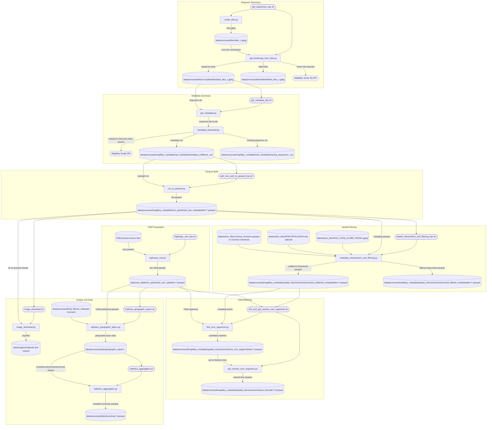
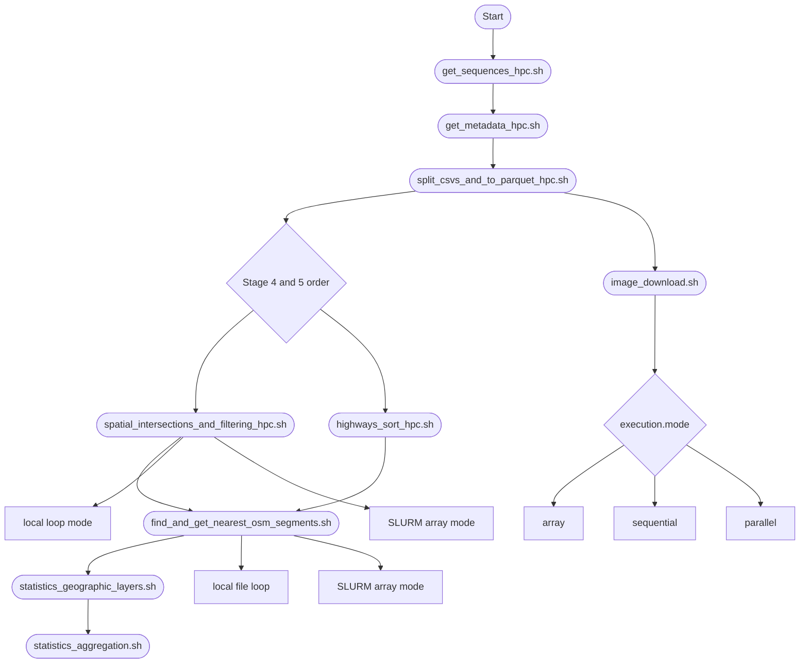

# Mapillary + OSM Road Surface Pipeline

## 1. What This Is

This repository is a tile-based geospatial pipeline for combining Mapillary street-level observations with OpenStreetMap road geometry and tags. It discovers Mapillary sequences, downloads image metadata, intersects points with administrative and urban-area layers, links points to nearby OSM segments, and computes road-surface statistics at multiple spatial levels.

The outputs are parquet datasets and image files organized by tile and aggregation level, designed for long-running batch processing on local machines and SLURM clusters. The code is optimized for chunked processing, resumability, and parallel execution rather than single-shot ad hoc analysis.

## 2. How the Pipeline Works

At a high level: tiles are generated first, then Mapillary sequence lines are downloaded, then sequence metadata is discovered and fetched. Raw CSV metadata is split and converted to tile-partitioned parquet, then spatially intersected and filtered. In parallel with metadata spatial filtering, OSM highways are cleaned and partitioned by tile. Finally, point-to-road matching and nearest-line resolution produce analysis-ready joins, while image download and statistics stages run from their own inputs.

Images will be fed into the ML pipeline, which is maintained separately from this repository. Before statistical aggregation steps can be executed, the inferred ML tags must be merged with the metadata — either the filtered metadata, the unfiltered metadata, or both. The merge script has not yet been updated, as the optimal integration strategy is still under consideration.

Previously, the spatially filtered metadata was split into 100 chunks. However, this approach may no longer be necessary due to the newly introduced resumability feature in the pipeline.

There is also another repository on the profile: surface-pavedness-to-hot. Since the metadata only contains POINT geometries, but potential users of this pipeline are typically accustomed to working with HOTOSM data, the repository downloads HOTOSM datasets for each country from HDX. It then either merges these datasets with the DL-OSM–enhanced, spatially filtered Mapillary metadata, or reconstructs the same data format directly from the Mapillary-derived data in cases where HOTOSM does not provide a corresponding file.


## 3. Repository Layout

```text
mapillary_cleaned/
├─ README.md                               Definitive pipeline documentation.
├─ environment.yaml                        Conda environment definition for runtime/test dependencies.
├─ data/                                   Runtime inputs and outputs (not source code).
├─ research_code/
│  ├─ config.yaml                          Canonical configuration with section-order inheritance.
│  ├─ config_utils.py                      Strict config parsing/validation helpers.
│  ├─ start.py                             Public config loader/resolver and runtime config builders.
│  ├─ create_tiles.py                      Stage 1 worker: builds tiles_z<zoom>.gpkg.
│  ├─ get_linestrings_from_tiles.py        Stage 1 worker: pulls Mapillary vector tiles and sequence lines.
│  ├─ get_metadata.py                      Stage 2 worker/orchestrator: tile chunking + metadata jobs.
│  ├─ metadata_download.py                 Stage 2 core downloader: bbox subdivision and async API fetch.
│  ├─ csv_to_parquet.py                    Stage 3 worker: CSV to parquet conversion with geometry casting.
│  ├─ metadata_intersections_and_filtering.py  Stage 4 worker: spatial joins + distance-based thinning.
│  ├─ highways_sort.py                     Stage 5 worker: OSM highway filtering + tile partitioning.
│  ├─ find_osm_segments.py                 Stage 6 worker: candidate point-to-road matching.
│  ├─ get_nearest_osm_segments.py          Stage 6 worker: nearest-selection post processing.
│  ├─ image_download.py                    Stage 7 worker: async image download and resize.
│  ├─ statistics_geographic_layers.py      Stage 8 worker: per-layer and per-geography stats.
│  ├─ statistics_aggregation.py            Stage 9 worker: compile/aggregate summary outputs.
│  ├─ dlr.py                               Standalone utility for a single z14 tile fetch.
│  ├─ get_sequences_hpc.sh                 Launcher for Stage 1 workers.
│  ├─ get_metadata_hpc.sh                  Launcher for Stage 2 workers (10 parallel instances).
│  ├─ split_csvs_and_to_parquet_hpc.sh     Launcher for Stage 3 splitting + conversion.
│  ├─ spatial_intersections_and_filtering_hpc.sh  Launcher for Stage 4 local/HPC array execution.
│  ├─ highways_sort_hpc.sh                 Launcher for Stage 5 worker.
│  ├─ find_and_get_nearest_osm_segments.sh Launcher for Stage 6 workers.
│  ├─ image_download.sh                    Launcher for Stage 7 with array/sequential/parallel modes.
│  ├─ statistics_geographic_layers.sh      Launcher for Stage 8 (SLURM array task id passthrough).
│  ├─ statistics_aggregation.sh            Launcher for Stage 9 (SLURM array task id passthrough).
│  └─ test.sh                              Small shell snippet (not a pipeline stage).
└─ tests/
   ├─ test_create_tiles.py                 Unit tests for stage 1 tile generation behavior.
   ├─ test_get_linestrings_from_tiles.py   Unit tests for Mapillary tile download and dedupe logic.
   ├─ test_get_metadata.py                 Unit tests for chunking/resume orchestration.
   ├─ test_metadata_download.py            Extensive tests for API handling, retries, buffers, threads.
   ├─ test_csv_to_parquet.py               Unit tests for conversion query generation and fallback logic.
   ├─ test_metadata_intersections_and_filtering.py  Tests layer prep, intersection flow, retry/timeout.
   ├─ test_highways_sort.py                Tests OSM filtering, retry behavior, and tile partition outputs.
   ├─ test_find_osm_segments.py            Tests haversine and stage-6 matching orchestration.
   ├─ test_get_nearest_osm_segments.py     Tests nearest-selection masks and output generation.
   ├─ test_image_download.py               Tests async download orchestration and cleanup behavior.
   ├─ test_statistics_geographic_layers.py Tests SQL helper generation and geographic-stage orchestration.
   ├─ test_statistics_aggregation.py       Tests aggregation query builders and orchestration paths.
   ├─ test_start.py                        Tests config inheritance and strict loader behavior.
   └─ test_dlr.py                          Tests standalone z14 utility.
```

## 4. Setup

1. Create environment:

```bash
conda env create -f environment.yaml
conda activate mapillary-road-surface-pipeline
```

2. Put your Mapillary token in config (required):
- `research_code/config.yaml` -> `get_linestrings_from_tiles.params.mly_key` ⚠️

3. System/runtime requirements:
- Python 3.11
- GDAL stack available (for geopandas/io)
- DuckDB with SPATIAL extension (scripts run `INSTALL SPATIAL; LOAD SPATIAL;`)
- Bash for launchers
- SLURM only if running HPC modes

4. Minimum `config.yaml` changes before first run:
- `get_linestrings_from_tiles.params.mly_key` ⚠️
- `highways_sort.paths.ohsome_osm_dir` (or ensure `osm_saving_dir` has the expected input files) ⚠️
- `metadata_download.metadata_params.query_bbox` if you are not running the current default area ⚠️

Everything else is documented in the configuration reference below.

## 5. Running the Pipeline

### Stage 1 — Tile Creation + Sequence Lines (`get_sequences_hpc.sh` + `create_tiles.py` + `get_linestrings_from_tiles.py`)

This stage builds the spatial tile grid and downloads sequence line geometries from Mapillary vector tiles. The shell script runs both Python workers in sequence, stopping immediately if stage 1a fails.

**Run:**
```bash
# local
bash research_code/get_sequences_hpc.sh

# HPC
sbatch research_code/get_sequences_hpc.sh
```

**Execution modes:** single sequential flow in both local and HPC (SBATCH header is static).

**Smart behaviors:**
- Resume logic: existing output files are overwritten by worker writes; no explicit skip-by-exists in launcher.
- Retry logic: tile download retries in `get_linestrings_from_tiles.py` (`metadata_params.retries`).
- Parallelism: internal loop over tiles; no explicit multiprocessing in this stage.

**Inputs:**
- `data/starter_files/overture_divisions.parquet` if present (used as polygon source)
- fallback optional `filenames.starter_polygon_fn` if configured

**Outputs:**
- `data/processed/tiles/tiles_z<zoom>.gpkg` (GeoPackage)
- `data/processed/tiles/completed/finished_tiles_z<zoom>.gpkg` (GeoPackage)
- `data/processed/tiles/failed/failed_tiles_z<zoom>.gpkg` (GeoPackage)

**To re-run from scratch:**
- delete `data/processed/tiles/tiles_z<zoom>.gpkg`
- delete `data/processed/tiles/completed/finished_tiles_z<zoom>.gpkg`
- delete `data/processed/tiles/failed/failed_tiles_z<zoom>.gpkg`

---

### Stage 2 — Metadata Discovery + Download (`get_metadata_hpc.sh` + `get_metadata.py` + `metadata_download.py`)

This stage discovers sequence IDs within bounding boxes, then downloads per-image metadata for each sequence. The shell launcher starts 10 parallel Python instances; each instance processes a deterministic chunk of tiles.

**Run:**
```bash
# local
bash research_code/get_metadata_hpc.sh

# HPC
sbatch research_code/get_metadata_hpc.sh
```

**Execution modes:**
- launcher always starts 10 background jobs (`get_metadata.py 1..10`).
- same script can run on local or HPC; worker reads `SLURM_CPUS_PER_TASK` when present.

**Smart behaviors:**
- Resume logic: `get_metadata.py` skips sequence IDs already present in existing `metadata_unfiltered_<tile>.csv`.
- Retry logic: multiple layers:
  - sequence API calls in `metadata_download.py`
  - missing sequence reattempts via `missing_attempts`
  - thread-safe flush/retry guards
- Parallelism:
  - deterministic chunking by `DETERMINISTIC_SEED=42`, `NUM_CHUNKS=10`
  - async HTTP batch download in `metadata_download.py`
  - monitoring threads for dynamic connection limits and buffered writes
- Other smart behavior:
  - dynamic allowed-connections throttling based on active job file patterns
  - forced final buffer flush + deterministic thread joins on shutdown

**Inputs:**
- `data/processed/tiles/completed/finished_tiles_z<zoom>.gpkg`
- Mapillary API access

**Outputs:**
- `data/processed/mapillary_metadata/raw_metadata/metadata_unfiltered_<tile>.csv`
- `data/processed/mapillary_metadata/raw_metadata/missing_sequences_<tile>.csv`

**To re-run from scratch:**
- delete all `data/processed/mapillary_metadata/raw_metadata/metadata_unfiltered_*.csv`
- delete all `data/processed/mapillary_metadata/raw_metadata/missing_sequences_*.csv`

---

### Stage 3 — Split and Convert to Parquet (`split_csvs_and_to_parquet_hpc.sh` + `csv_to_parquet.py`)

This stage optionally splits large metadata CSV files and converts metadata into parquet with WKT geometry cast to WKB. The shell script reads configuration through `start.py`, performs incremental split-resume, then calls Python conversion per tile.

**Run:**
```bash
# local
bash research_code/split_csvs_and_to_parquet_hpc.sh

# HPC
sbatch research_code/split_csvs_and_to_parquet_hpc.sh
```

**Execution modes:** single shell flow; parallelism is at file-level iteration in shell, not process pool.

**Smart behaviors:**
- Resume logic:
  - split logic resumes from existing numbered chunks (`splitted_<name>_*.csv`)
  - conversion prefers recent split files, falls back to raw csv if no recent split found
- Retry logic: none at shell level; conversion logs errors per file.
- Parallelism: none explicit in launcher.
- Other smart behavior:
  - timestamp gating (`csv_split_params.updated_after`) to process only recent files

**Inputs:**
- `data/processed/mapillary_metadata/raw_metadata/metadata_unfiltered_*.csv`

**Outputs:**
- `data/processed/mapillary_metadata/splitted_raw_metadata/splitted_metadata_unfiltered_<tile>_*.csv`
- `data/processed/mapillary_metadata/hive_partitioned_raw_metadata/tile=<tile>/*.parquet`

**To re-run from scratch:**
- delete `data/processed/mapillary_metadata/splitted_raw_metadata/*`
- delete `data/processed/mapillary_metadata/hive_partitioned_raw_metadata/*`

---

### Stage 4 — Spatial Intersections + Filtering (`spatial_intersections_and_filtering_hpc.sh` + `metadata_intersections_and_filtering.py`)

This stage enriches metadata points with continent/country/urban-area context and applies distance-based sequence thinning (`urban_threshold`, `rural_threshold`). The launcher can self-submit an array job on HPC or run bounded parallel local workers.

**Run:**
```bash
# local
bash research_code/spatial_intersections_and_filtering_hpc.sh

# HPC
sbatch research_code/spatial_intersections_and_filtering_hpc.sh
```

**Execution modes:**
- HPC: self-submits SLURM array if not already in array task context.
- local: CPU-detected parallel loop with cap (`MAX_PARALLEL=6`).

**Smart behaviors:**
- Resume logic:
  - launcher selects input parquet files newer than `metadata_params.updated_after`
  - worker skips old files by mtime check
  - one-time layer preparation based on first-tile heuristic
- Retry logic:
  - worker wraps main intersection path in up to 3 attempts
- Parallelism:
  - file-level parallel processing in shell
  - spatial SQL done in DuckDB per file
- Other smart behavior:
  - on-demand Overture country download
  - conversion of GHSL/Africapolis to parquet when needed
  - bounded waits for synchronization and temp cleanup

**Inputs:**
- `data/processed/mapillary_metadata/hive_partitioned_raw_metadata/tile=<tile>/*.parquet`
- `data/starter_files/GHS_UCDB_GLOBE_R2024A.gpkg`
- optional `data/starter_files/AFRICAPOLIS2020.shp` set

**Outputs:**
- `data/processed/mapillary_metadata/spatial_intersections/intersected_unfiltered_metadata/tile=<tile>/*.parquet`
- `data/processed/mapillary_metadata/spatial_intersections/intersected_filtered_metadata/tile=<tile>/*.parquet`
- derived layer files under `data/processed/` (intersected country/urban helper parquet)

**To re-run from scratch:**
- delete both `intersected_unfiltered_metadata` and `intersected_filtered_metadata`
- if you want to rebuild derived geographic helper layers, also delete `data/processed/intersected_*.parquet` and `data/processed/country_intersected_*.parquet`

---

### Stage 5 — OSM Highway Preparation (`highways_sort_hpc.sh` + `highways_sort.py`)

This stage filters OSM way parquet files to highway LineStrings, joins continent/country attributes, and partitions output by tile. It is independent of Stage 4 once Stage 3 and required geographic layers are available, so Stage 4 and Stage 5 can run in parallel.

**Run:**
```bash
# local
bash research_code/highways_sort_hpc.sh

# HPC
sbatch research_code/highways_sort_hpc.sh
```

**Execution modes:** launcher is simple single-worker invocation; worker itself uses process pools.

**Smart behaviors:**
- Resume logic: output files are rewritten; no skip-by-exists in main flow.
- Retry logic:
  - copy/count/chunk operations have retry loops
  - hard failure if count or chunk retries are exhausted
- Parallelism:
  - process pool across OSM input files
  - process pool for tile partition writes

**Inputs:**
- OSM parquet files in `paths.ohsome_osm_dir` (must be configured)
- intersected geography files from layer setup (`continents`, `country`)

**Outputs:**
- `data/osm_data/ohsome_data/highways_*.parquet` (intermediate filtered)
- `data/osm_data/hive_partitioned_osm_data/tile=<tile>/osm_highways_<tile>_<chunk>.parquet`

**To re-run from scratch:**
- delete `data/osm_data/ohsome_data/*.parquet` generated by this stage
- delete `data/osm_data/hive_partitioned_osm_data/tile=*`

---

### Stage 6 — OSM Matching + Nearest Resolution (`find_and_get_nearest_osm_segments.sh` + `find_osm_segments.py` + `get_nearest_osm_segments.py`)

This stage links metadata points to nearby OSM segments and then resolves multiple candidates per image with threshold bands (`threshold_1`, `threshold_2`). The shell script processes each metadata parquet file by calling both workers sequentially.

**Run:**
```bash
# local
bash research_code/find_and_get_nearest_osm_segments.sh

# HPC
sbatch research_code/find_and_get_nearest_osm_segments.sh
```

**Execution modes:**
- HPC: self-submits array and runs one file per task.
- local: loop over files (current implementation calls workers synchronously).

**Smart behaviors:**
- Resume logic:
  - `find_osm_segments.py` skips old files using `metadata_params.updated_after`
  - both workers skip if expected input path is missing
- Retry logic: query-level retries are minimal; robustness is mostly guard/skip behavior.
- Parallelism:
  - HPC array-level parallelism
  - local mode currently mostly sequential per file
- Other smart behavior:
  - tile id extracted from filename tokens
  - DuckDB UDF for haversine distance

**Inputs:**
- `intersected_unfiltered_metadata/tile=<tile>/*.parquet`
- `hive_partitioned_osm_data/tile=<tile>/*.parquet`

**Outputs:**
- `data/processed/mapillary_metadata/spatial_intersections/found_osm_segments/tile=<tile>/osm_*_metadata_unfiltered_<tile>.parquet`
- `data/processed/mapillary_metadata/spatial_intersections/nearest_lines/tile=<tile>/closest_metadata_unfiltered_<tile>.parquet`

**To re-run from scratch:**
- delete `found_osm_segments/tile=*`
- delete `nearest_lines/tile=*`

---

### Stage 7 — Image Download (`image_download.sh` + `image_download.py`)

This stage downloads and resizes images from metadata URLs. The shell script reads execution mode from config and dispatches chunks accordingly.

**Run:**
```bash
# local
bash research_code/image_download.sh

# HPC
sbatch research_code/image_download.sh
```

**Execution modes:**
- `array`: HPC only, one chunk per SLURM task.
- `sequential`: one chunk at a time.
- `parallel`: multiple chunks concurrently.

**Smart behaviors:**
- Resume logic:
  - each file write path is deterministic by image id; failed downloads recorded in `logs/missing_*.csv`
  - missing-image writer thread continuously flushes failures
- Retry logic:
  - per-image retries with exponential backoff in async fetch path
- Parallelism:
  - shell chunk-level mode dispatch
  - Python thread pool + async HTTP batches inside each chunk
- Other smart behavior:
  - dynamic connection quota replenishment thread
  - cleanup of partially written files for failed images

**Inputs:**
- `data/processed/mapillary_metadata/hive_partitioned_raw_metadata/tile=<tile>/*.parquet` (contains id/url)

**Outputs:**
- `data/images/<tile>/originals/<id>.png` (if enabled)
- `data/images/<tile>/resized/<id>.png`
- `data/images/logs/missing_<parquet_basename>.csv`

**To re-run from scratch:**
- delete `data/images/<tile>/originals` and `data/images/<tile>/resized`
- delete `data/images/logs/missing_*.csv`

---

### Stage 8 — Geographic Layer Statistics (`statistics_geographic_layers.sh` + `statistics_geographic_layers.py`)

This stage computes metrics at z14/z8/country/continent/world and optional urban layers using DuckDB SQL fragments and process pools. The shell script forwards SLURM task id.

**Run:**
```bash
# local
python research_code/statistics_geographic_layers.py

# HPC
sbatch research_code/statistics_geographic_layers.sh
```

**Execution modes:**
- local direct run (unsharded) or optional CLI sharding args in Python
- HPC SLURM array task id pass-through

**Smart behaviors:**
- Resume logic: script exits early if `paths.final_filtered_dir` does not exist.
- Retry logic: none explicit around SQL blocks.
- Parallelism: process pool over directory shards.

**Inputs:**
- `paths.final_filtered_dir` parquet directory (must exist)
- `paths.osm_partitioned_dir` tile OSM parquet

**Outputs:**
- `data/processed/stats/geographic_layers/` with z14/z8/country/continent/world and urban-layer parquet shards

**To re-run from scratch:**
- delete `data/processed/stats/geographic_layers/*`

---

### Stage 9 — Aggregation Compile (`statistics_aggregation.sh` + `statistics_aggregation.py`)

This stage compiles stage-8 shard outputs into final all-level parquet summaries and optional non-temporal OSM rollups. The shell script forwards SLURM task id.

**Run:**
```bash
# local
python research_code/statistics_aggregation.py

# HPC
sbatch research_code/statistics_aggregation.sh
```

**Execution modes:**
- local direct run
- HPC array wrapper

**Smart behaviors:**
- Resume logic: writes compiled parquet targets deterministically in summary directory.
- Retry logic: none explicit; resource cleanup handled in `finally` blocks.
- Parallelism: process pools for optional country-based OSM processing.

**Inputs:**
- stage-8 geographic-layer parquet outputs
- configured country/continent/urban helper layers

**Outputs:**
- `data/processed/stats/summary/z14_tiles_with_stats_all.parquet`
- `data/processed/stats/summary/<zoom>_tiles_with_stats_all.parquet`
- `data/processed/stats/summary/countries_with_stats_all.parquet`
- `data/processed/stats/summary/continents_with_stats_all.parquet`
- `data/processed/stats/summary/world_with_stats_all.parquet`

**To re-run from scratch:**
- delete `data/processed/stats/summary/*.parquet`

---

Shell-only execution and mode graph:



## 6. Data Layout

Expected `data/` layout after a full successful run:

```text
data/
├─ starter_files/                                                Pre-run inputs
│  ├─ overture_divisions.parquet                                 Source polygon for tile clipping or auto-generated helper
│  ├─ GHS_UCDB_GLOBE_R2024A.gpkg                                 Stage 4 input (urban layer)
│  ├─ AFRICAPOLIS2020.shp (+ .dbf/.shx/.prj)                    Stage 4 optional input
│  └─ continents/*.geojson                                       Stage 4 helper input
├─ processed/
│  ├─ tiles/                                                     Stage 1 outputs (GPKG)
│  │  ├─ tiles_z<zoom>.gpkg
│  │  ├─ completed/finished_tiles_z<zoom>.gpkg
│  │  └─ failed/failed_tiles_z<zoom>.gpkg
│  ├─ mapillary_metadata/
│  │  ├─ raw_metadata/                                           Stage 2 outputs (CSV)
│  │  │  ├─ metadata_unfiltered_<tile>.csv
│  │  │  └─ missing_sequences_<tile>.csv
│  │  ├─ splitted_raw_metadata/                                  Stage 3 split outputs (CSV)
│  │  ├─ hive_partitioned_raw_metadata/                          Stage 3 parquet outputs
│  │  │  └─ tile=<tile>/*.parquet
│  │  └─ spatial_intersections/                                  Stage 4 and 6 outputs
│  │     ├─ intersected_unfiltered_metadata/tile=<tile>/*.parquet
│  │     ├─ intersected_filtered_metadata/tile=<tile>/*.parquet
│  │     ├─ found_osm_segments/tile=<tile>/*.parquet
│  │     └─ nearest_lines/tile=<tile>/*.parquet
│  ├─ stats/                                                     Stage 8 and 9 outputs
│  │  ├─ geographic_layers/*.parquet
│  │  └─ summary/*.parquet
│  └─ final_filtered_metadata/                                   Required by Stage 8; not produced by earlier shell stages directly
├─ osm_data/
│  ├─ ohsome_data/                                               Stage 5 filtered/intermediate OSM parquet
│  └─ hive_partitioned_osm_data/tile=<tile>/*.parquet           Stage 5 final OSM partitions
└─ images/
   ├─ <tile>/originals/*.png                                     Stage 7 optional original images
   ├─ <tile>/resized/*.png                                       Stage 7 resized outputs
   └─ logs/missing_*.csv                                         Stage 7 failed-download logs
```

## 7. Configuration Reference

The full configuration reference has been moved to [CONFIGURATION_REFERENCE.md](CONFIGURATION_REFERENCE.md).
## 8. Known Issues

1. **Hardcoded Python path in stage 6 launcher**
- Where: `research_code/find_and_get_nearest_osm_segments.sh`, top-level `PYTHON_BIN` assignment.
- What happens: launcher fails on machines without `/mnt/d//micromamba/envs/eren/python.exe`.
- Why: executable path is hardcoded instead of using environment discovery.
- Workaround: set `PYTHON_BIN="python"` (or your env path) before running.

2. **Import-time config side effects in aggregation module**
- Where: `research_code/statistics_aggregation.py`, module-level `_BOOT_CFG = load_config()` and `_METRICS = build_metric_catalog(...)`.
- What happens: importing module triggers config parsing immediately.
- Why: config/metric initialization is at module scope instead of `main()` or lazy init.
- Workaround: run as script in expected project context; avoid importing in environments where config is unavailable.

3. **Stage 8 input directory is not produced by earlier shell stages**
- Where: `research_code/statistics_geographic_layers.py` (`paths.final_filtered_dir`) and `research_code/config.yaml` (`statistics_geographic_layers.paths.final_filtered_dir`).
- What happens: stage 8 logs skip and exits when `data/processed/final_filtered_metadata` does not exist.
- Why: pipeline shell stages produce `intersected_filtered_metadata`, but stage 8 expects `final_filtered_metadata` path.
- Workaround: either create/populate `final_filtered_metadata` or point `statistics_geographic_layers.paths.final_filtered_dir` to the produced filtered directory.

4. **Local mode in stage 6 launcher is effectively sequential**
- Where: `research_code/find_and_get_nearest_osm_segments.sh`, local branch.
- What happens: script appends `$!` without backgrounding Python commands, so local branch does not parallelize as intended.
- Why: missing `&` on worker invocations in local loop.
- Workaround: use SLURM array mode or run multiple files manually in parallel from shell.

## 9. Contributing & Tests

Run tests:

```bash
# preferred if pytest is available
python -m pytest tests

# baseline runner used by repo test style
python -m unittest discover -s tests
```

What is covered:
- all pipeline workers and launch-critical helpers have unit tests
- heavy use of mocks for API, DuckDB, filesystem, and thread behavior
- strong coverage for retry/flush/thread-shutdown edge cases in metadata and image download logic

When adding a new stage, keep this checklist:
1. Add a new section in `research_code/config.yaml` in the correct stage order.
2. Use `start.py` + strict accessors (`require_path`, typed parsers) instead of ad hoc defaults.
3. Provide a shell launcher if the stage needs operational orchestration (local/HPC).
4. Make resume behavior explicit (mtime checks, existing-output checks, or documented overwrite policy).
5. Add tests for happy path, skip/resume behavior, and failure/retry behavior.
6. Avoid module-level side effects that run on import.
