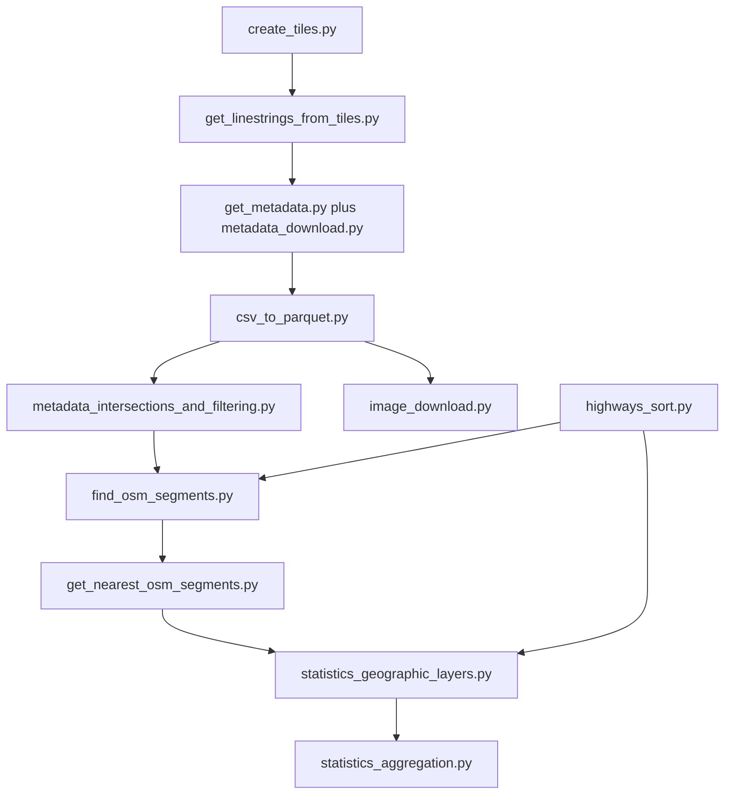

# Mapillary-OSM-Road-Surface-Pipeline

This repository implements a multi-stage geospatial processing pipeline that integrates Mapillary observations with OpenStreetMap (OSM) road geometry and tags to produce analysis-ready road-surface data products. The primary objective is to build a reproducible workflow for large-scale extraction, spatial alignment, filtering, and aggregation of street-level and network-level information.

Conceptually, the pipeline treats Mapillary observations as point- or sequence-based evidence and OSM as the structural road network context. The processing chain first standardizes both sources to a shared tile framework, then performs spatial enrichment and nearest-segment matching, and finally computes geographic and summary statistics. Runtime behavior is controlled through research_code/config.yaml, while shell wrappers provide local and SLURM-compatible execution paths.

## Table of Contents

- [Data Sources](#data-sources)
- [Mapillary API](#mapillary-api)
- [OpenStreetMap (OSM)](#openstreetmap-osm)
- [Geographic Reference Layers](#geographic-reference-layers)
- [Statistics Inputs](#statistics-inputs)
- [Pipeline Approaches and Logic](#pipeline-approaches-and-logic)
- [What This Repository Contains](#what-this-repository-contains)
- [Canonical Script Run Order](#canonical-script-run-order)
- [Project Data Flow](#project-data-flow)
- [Environment Creation](#environment-creation)
- [Conda](#conda)
- [Optional pip-based setup](#optional-pip-based-setup)
- [Starter Data Files You Need Before Running](#starter-data-files-you-need-before-running)
- [Configuration Parameters You Usually Need To Change](#configuration-parameters-you-usually-need-to-change)
- [What Is Missing Or External To The Repository](#what-is-missing-or-external-to-the-repository)
- [Section Documentation](#section-documentation)
- [Test Commands](#test-commands)

## Data Sources

### Mapillary API
Mapillary is used in two complementary ways:

- vector tile retrieval for sequence-line extraction,
- graph endpoint retrieval for per-sequence image metadata.

Required setting:
- get_linestrings_from_tiles.params.mly_key

### OpenStreetMap (OSM)
OSM way parquet files are filtered to relevant highway classes, spatially prepared, and partitioned by tile for downstream matching.

Required setting:
- highways_sort.paths.ohsome_osm_dir

### Geographic Reference Layers
Spatial intersection and filtering steps require continent, country, and urban reference layers.

Expected starter files in data/starter_files:
- overture_divisions.parquet
- GHS_UCDB_GLOBE_R2024A.gpkg
- continents/*.geojson
- optional: AFRICAPOLIS2020.*

### Statistics Inputs
The statistics stages depend on prepared OSM tiles and filtered metadata products.

Important path:
- statistics_geographic_layers.paths.final_filtered_dir

## Pipeline Approaches and Logic

The workflow is implemented as a staged processing system:

1. tile creation and sequence line extraction,
2. sequence discovery and metadata retrieval,
3. CSV normalization and parquet conversion,
4. spatial enrichment and filtering,
5. OSM highway preparation,
6. point-to-road candidate matching and nearest resolution,
7. optional image retrieval,
8. geographic-layer statistics,
9. aggregated summary statistics.

The operational design emphasizes three properties:

- reproducibility through deterministic chunking and strict configuration resolution,
- robustness through bounded retries and controlled background flushing,
- scalability through tile-based partitioning and staged orchestration.

## What This Repository Contains

| Area | Location | Purpose |
| --- | --- | --- |
| Runtime configuration | research_code/config.yaml | Global paths and parameter control |
| Config resolver | research_code/start.py, research_code/config_utils.py | Strict inheritance, validation, and typed parsing |
| Stage 1 | research_code/create_tiles.py, research_code/get_linestrings_from_tiles.py, research_code/get_sequences_hpc.sh | Tile generation and sequence-line extraction |
| Stage 2 | research_code/get_metadata.py, research_code/metadata_download.py, research_code/get_metadata_hpc.sh | Sequence discovery and metadata download |
| Stage 3 | research_code/csv_to_parquet.py, research_code/split_csvs_and_to_parquet_hpc.sh | Metadata CSV splitting and parquet conversion |
| Stage 4 | research_code/metadata_intersections_and_filtering.py, research_code/spatial_intersections_and_filtering_hpc.sh | Spatial intersections and filtering |
| Stage 5 | research_code/highways_sort.py, research_code/highways_sort_hpc.sh | OSM filtering and tile partitioning |
| Stage 6 | research_code/find_osm_segments.py, research_code/get_nearest_osm_segments.py, research_code/find_and_get_nearest_osm_segments.sh | OSM candidate and nearest-segment matching |
| Stage 7 | research_code/image_download.py, research_code/image_download.sh | Optional image download and resize |
| Stage 8 | research_code/statistics_geographic_layers.py, research_code/statistics_geographic_layers.sh | Geographic-layer metric production |
| Stage 9 | research_code/statistics_aggregation.py, research_code/statistics_aggregation.sh | Aggregated summary metric production |
| Tests | tests/ | Unit tests across core modules and orchestration helpers |

## Canonical Script Run Order

The canonical production order is:

1. research_code/get_sequences_hpc.sh
2. research_code/get_metadata_hpc.sh
3. research_code/split_csvs_and_to_parquet_hpc.sh
4. research_code/spatial_intersections_and_filtering_hpc.sh
5. research_code/highways_sort_hpc.sh
6. research_code/find_and_get_nearest_osm_segments.sh
7. research_code/image_download.sh (optional)
8. research_code/statistics_geographic_layers.sh or python research_code/statistics_geographic_layers.py
9. research_code/statistics_aggregation.sh or python research_code/statistics_aggregation.py

Operational notes:
- stages 4 and 5 can be executed in either order (or in parallel) after stage 3,
- stage 7 is optional and does not block stages 8-9.

## Project Data Flow



## Environment Creation

The repository provides environment.yaml for reproducible setup.

### Conda
```bash
conda env create -f environment.yaml
conda activate mapillary-road-surface-pipeline
```

### Optional pip-based setup
Create a virtual environment and install dependencies equivalent to environment.yaml.

Practical prerequisites:
- Python 3.11,
- internet access for API and remote data retrieval,
- SLURM only if cluster wrappers are used.

## Starter Data Files You Need Before Running

The workflow depends on baseline inputs; without them, stages cannot complete successfully.

| Data file or directory | Consumed by | Required |
| --- | --- | --- |
| data/starter_files/overture_divisions.parquet | tile clipping and country-layer preparation | yes |
| data/starter_files/GHS_UCDB_GLOBE_R2024A.gpkg | urban-layer intersection | yes |
| data/starter_files/continents/*.geojson | continent assignment | yes |
| data/starter_files/AFRICAPOLIS2020.* | additional urban-layer intersection | optional |
| OSM parquet directory configured via highways_sort.paths.ohsome_osm_dir | OSM preparation and matching | yes |

## Configuration Parameters You Usually Need To Change

Before a first full run, review at least these keys:

| Config key | Why it matters |
| --- | --- |
| get_linestrings_from_tiles.params.mly_key | API authentication for Mapillary requests |
| metadata_download.metadata_params.query_bbox | geographic retrieval extent |
| get_metadata.metadata_params.deterministic_seed | reproducible shuffling seed for metadata chunk assignment |
| get_metadata.metadata_params.num_chunks | number of deterministic metadata chunks for parallel instances |
| dlr.params.zoom_level | tile zoom level used by the DLR utility script |
| create_tiles.params.zoom_level | tile granularity across stages |
| highways_sort.paths.ohsome_osm_dir | OSM source directory |
| find_osm_segments.params.distance_threshold | point-to-road matching tolerance |
| get_nearest_osm_segments.params.threshold_1 | nearest-segment decision threshold (band 1) |
| get_nearest_osm_segments.params.threshold_2 | nearest-segment decision threshold (band 2) |
| image_download.image_params.allowed_connections | global request budget used by image download workers |
| image_download.execution.mode | local/HPC dispatch mode |
| image_download.execution.num_jobs | chunk/job fan-out for image retrieval |
| statistics_geographic_layers.paths.final_filtered_dir | expected stage-8 metadata input |

For the complete configuration catalog, see CONFIGURATION_REFERENCE.md.

## What Is Missing Or External To The Repository

The repository expects several external assets or environment-specific adjustments:

- a valid Mapillary token,
- OSM parquet inputs at the configured OSM path,
- adaptation of static SLURM resource headers where needed,
- population of statistics_geographic_layers.paths.final_filtered_dir before stage 8.

## Section Documentation

Detailed implementation references:

| Section | Main files |
| --- | --- |
| Configuration bootstrap | research_code/start.py, research_code/config_utils.py, research_code/config.yaml |
| Metadata retrieval internals | research_code/metadata_download.py, tests/test_metadata_download.py |
| OSM matching internals | research_code/find_osm_segments.py, research_code/get_nearest_osm_segments.py |
| Statistics internals | research_code/statistics_geographic_layers.py, research_code/statistics_aggregation.py |

## Test Commands

```bash
python -m unittest discover -s tests
```

If pytest is installed:

```bash
python -m pytest tests
```
